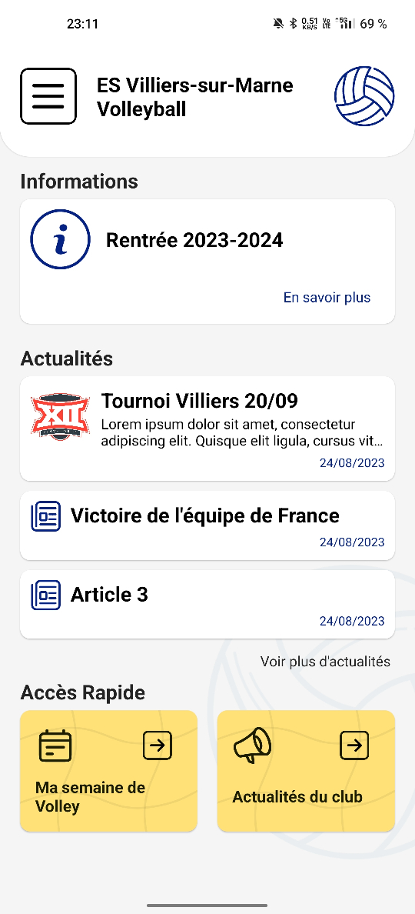
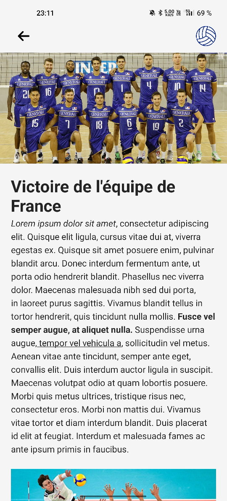
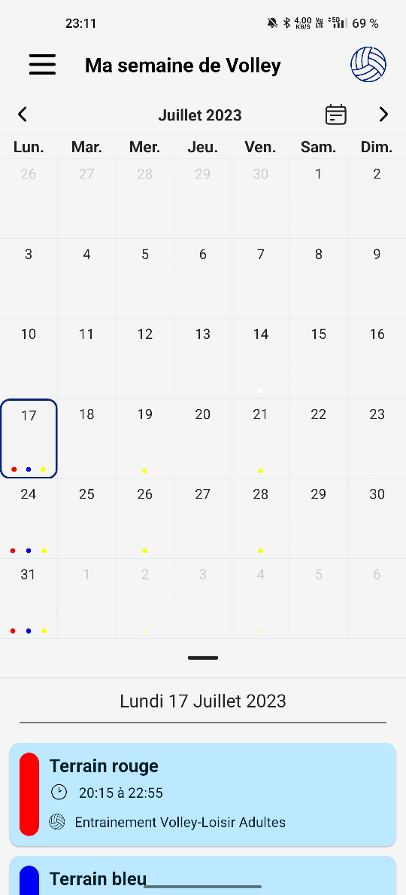
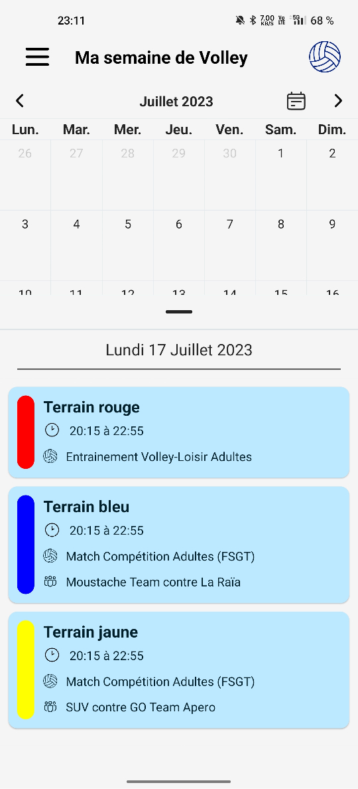

# Villiers Volley Mobile App

## Présentation

Cette application est un projet personnel développé from scratch en React Native,
afin de continuer à développer mes compétences en programmation mobile sur mon temps personnel.

L'application a pour but d'aider les membres du club de volley à acceder aux informations du club, qu'il s'agisse des informations générales ou des actualités du club.
Le but premier est cependant d'avoir accès au horaires des entrainements et des matchs proposés par le club.

Le back-end est un strapi, mais les données sont actuellement en brut en local pour une question de démonstration. Le Strapi est cependant développé en parallèle.

/!\ Cette application est un travail en cours, elle n'est pas terminée. /!\

A venir:
- Système de comptes avec différentes autorisations
- Possibilité d'ajouter ou de modifier des entrainements ou des match si l'utilisateur est un entraineur
- Possibilité de personnaliser l'affichage des entrainements et matchs en fonction du groupe dans lequel on joue

## Ecrans

 && 

Ecran d'accueil et ecran d'un article, récupéré en html puis affiché

 && 

Ecran du calendrier d'entrainements / de matchs
